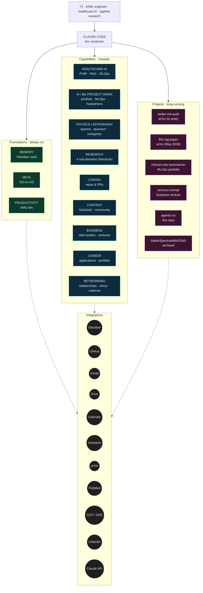

# Agentic OS — Architecture

Claude Code as a personal AI operating system for **TJ — AI/ML engineer, healthcare AI, applied research, teaching, and a Substack on the side**. Adapted from a generic agency-style reference; rebuilt around TJ's actual surfaces, evidenced by the resume, GitHub, and tirtheshjani.com.

## Who this is for

| Surface             | Where it shows up                                                       |
|---------------------|-------------------------------------------------------------------------|
| Production (day job)| metricHEALTH Solutions — FHIR + SOC 2 + Dynamics 365 integrations       |
| Applied research    | First-author arXiv preprint (May 2026 — FHIR vs LLM-narrative RAG); stellar-mk-audit paper in prep |
| Side ML projects    | Clinical Note Summarizer (FLAN-T5 + GKE MLOps); StellarSpectraWithGONS |
| Teaching & outreach | Tech Titans (Barrie Library), OPLA Research & Evaluation Committee     |
| Writing             | *An Anxious Nomad Collective* — weekly Substack (essays, poetry, book reviews) |
| Career              | Open to AI/ML roles                                                     |

The Agentic OS does not orchestrate the day job (proprietary, off-laptop). It orchestrates everything else.

## Modes

| Mode    | Means                                                     |
|---------|-----------------------------------------------------------|
| MANUAL  | TJ types a prompt or clicks a skill in the dashboard      |
| SKILL   | A `SKILL.md`-defined task runs (one-shot or via shortcut) |
| ROUTINE | A scheduled run (`automations/local/` cron or `automations/remote/` cloud cron) |
| AGENT   | A multi-step plan executed by an autonomous agent loop    |

## Diagram

## Branches and skills

Cadence legend: **M** manual · **L** local cron · **R** remote/cloud cron · **A** agent-loop · **(stub)** planned, not yet authored

### Foundations — always on

**MEMORY** — Obsidian vault is the durable substrate.

| Path                  | Role                              |
|-----------------------|-----------------------------------|
| `vault/raw/`          | staging (daily dump, scan output) |
| `vault/wiki/`         | compiled knowledge base           |
| `vault/projects/`     | active per-project notes          |
| `CLAUDE.md`           | prompt context (per-repo)         |
| `.claude/memory/`     | auto memory                       |

**META** — OS-on-OS skills (author/manage skills + agents):

| Skill                          | Cadence | Notes                            |
|--------------------------------|:-------:|----------------------------------|
| `_meta/skill-creator`          | M       | scaffolds new SKILL.md           |
| `_meta/writing-plans`          | M       | plans for multi-step work        |
| `_meta/executing-plans`        | M / A   | runs plans task-by-task          |
| `_meta/memory-curator`         | M / L   | trims & promotes memory entries  |
| `_meta/karpathy-guidelines`    | M       | behavioral rules at code time    |
| `_meta/verification-before-completion` | M | pre-commit verification gate |

**PRODUCTIVITY** — daily personal ops:

| Skill                              | Cadence | Outputs                              |
|------------------------------------|:-------:|--------------------------------------|
| `business/inbox-triage`            | L (am)  | `vault/raw/daily/<date>-inbox.md`    |
| `business/calendar-prep`           | L (am)  | `vault/raw/daily/<date>-cal.md`      |
| `business/weekly-rollup`           | L (Sun) | `vault/wiki/weekly/<week>.md`        |
| `productivity/daily-rollup`        | L (eod) | `vault/raw/daily/<date>-eod.md`      |
| `productivity/vault-cleanup`       | L (weekly) | promotes raw → wiki, archives     |

### Capabilities — modular

**HEALTHCARE-AI** — production-style work outside the day job (the FHIR/MLOps surface that feeds the arXiv paper and portfolio):

| Skill                             | Cadence | Notes                                   |
|-----------------------------------|:-------:|-----------------------------------------|
| `healthcare-ai/fhir-bundle-inspect` (stub) | M | validate FHIR R4B bundles, surface gaps |
| `healthcare-ai/synthea-cohort-gen` (stub)  | M | generate synthetic patient cohorts      |
| `healthcare-ai/clinical-note-eval` (stub)  | M | run eval harness against FLAN-T5 summarizer |
| `healthcare-ai/mlops-deploy-check` (stub)  | M / R | verify GKE Autopilot pipeline health |
| `healthcare-ai/rag-experiment-runner` (stub) | M | repro structured vs narrative RAG runs |

**RESEARCH** — literature watching and research workflows (academic, not production):

| Sub-domain      | Skill                                       | Cadence |
|-----------------|---------------------------------------------|:-------:|
| general         | `research/general/deep-web-research`        | M       |
| general         | `research/general/literature-review`        | M       |
| general         | `research/general/morning-trend-scan`       | L (am)  |
| general         | `research/general/paper-search`             | M       |
| general         | `research/general/research-lookup`          | M       |
| general         | `research/general/scientific-writing`       | M       |
| general         | `research/general/youtube-search`           | M       |
| physics-ml      | `research/physics-ml/arxiv-daily-digest`    | R (am)  |
| physics-ml      | `research/physics-ml/ml-twitter-watch`      | R (am)  |
| physics-ml      | `research/physics-ml/paper-summary`         | M       |
| healthcare-tech | `research/healthcare-tech/pubmed-digest`    | R (am)  |
| healthcare-tech | `research/healthcare-tech/healthcare-arxiv` | R (am)  |
| healthcare-tech | `research/healthcare-tech/regulatory-watch` | R (weekly) |
| data-science    | `research/data-science/kaggle-watch`        | R (weekly) |
| data-science    | `research/data-science/dataset-scan`        | M       |
| data-science    | `research/data-science/benchmark-tracker`   | M       |

**CODING** — repo & PR work:

| Skill                          | Cadence | Notes                                      |
|--------------------------------|:-------:|--------------------------------------------|
| `coding/repo-onboarding`       | M       | CLAUDE.md scaffold + initial map           |
| `coding/issue-triage`          | M / R   | GitHub MCP                                 |
| `coding/pr-review-prep`        | M       | summarizes diff, surfaces checks           |

**CONTENT** — writing and publishing:

| Surface           | Skill                                          | Cadence |
|-------------------|------------------------------------------------|:-------:|
| general           | `content/avoid-ai-writing`                     | M       |
| anxious-nomad     | `content/anxious-nomad/newsletter-roundup`     | L (weekly) |
| anxious-nomad     | `content/anxious-nomad/collective-update`      | L (monthly) |
| anxious-nomad     | `content/anxious-nomad/reader-engagement` (stub) | L (weekly) |
| substack          | `content/substack/draft-from-vault`            | M       |
| substack          | `content/substack/substack-publish-prep`       | M       |
| community         | `content/community/comment-digest`             | L / R   |
| community         | `content/community/engagement-report`          | L (weekly) |

**AI / ML PROJECT WORK** — portfolio-grade ML work that isn't healthcare-specific (MLOps, hackathons, generative models, quantum-ML side projects):

| Skill                                  | Cadence | Notes                                          |
|----------------------------------------|:-------:|------------------------------------------------|
| `aiml/experiment-runner` (stub)        | M       | reproducible MLflow-tracked training run       |
| `aiml/hf-finetune-scaffold` (stub)     | M       | scaffold a HuggingFace Transformers fine-tune  |
| `aiml/mlops-pipeline-check` (stub)     | M / R   | GKE Autopilot + GitHub Actions health probe    |
| `aiml/dataset-card-gen` (stub)         | M       | HF datasets card from a DVC-tracked dataset    |
| `aiml/inference-spike` (stub)          | M       | quick latency / cost probe for a hosted model  |
| `aiml/hackathon-scaffold` (stub)       | M       | starter for Cohere / OpenAI / Anthropic API sprint |
| `aiml/eval-harness-run` (stub)         | M       | replay an eval suite against a checkpoint      |

**PHYSICS / ASTRONOMY RESEARCH** — domain-specific science work (stellar spectroscopy, quantum ML, computational physics):

| Skill                                  | Cadence | Notes                                          |
|----------------------------------------|:-------:|------------------------------------------------|
| `physics/fits-quick-look` (stub)       | M       | inspect a FITS spectrum (header + plot)        |
| `physics/spectra-rebin` (stub)         | M       | log-lambda resample at chosen R                |
| `physics/mk-classify` (stub)           | M       | apply MK class rubric to a single spectrum     |
| `physics/crossmatch-survey` (stub)     | M       | RA/Dec cross-match across APOGEE/GALAH/GES     |
| `physics/pickles-benchmark` (stub)     | M       | run Pickles 1998 template-library check        |
| `physics/astropy-pipeline-stub` (stub) | M       | Astropy + DVC pipeline scaffold                |
| `physics/qiskit-vqc-bench` (stub)      | M       | Variational Quantum Circuit benchmark          |
| `physics/bibtex-from-arxiv` (stub)     | M       | turn arXiv IDs into a citation block           |

**BUSINESS** — side hustles, ventures, and money flowing through them:

| Skill                                   | Cadence | Notes                                         |
|-----------------------------------------|:-------:|-----------------------------------------------|
| `business/venture-tracker` (stub)       | L (weekly) | P&L per active venture                     |
| `business/proposal-draft` (stub)        | M       | freelance / contract proposal from notes      |
| `business/invoice-prep` (stub)          | M       | invoice scaffold from time log                |
| `business/substack-revenue` (stub)      | L (weekly) | Anxious Nomad subs, conversions, churn     |
| `business/portfolio-product-launch` (stub) | M    | launch checklist for a new offering           |
| `business/monthly-financials` (stub)    | L (monthly) | aggregate venture P&L into one note        |

> Note: `business/inbox-triage`, `calendar-prep`, `weekly-rollup` live under **PRODUCTIVITY** (personal ops). This BUSINESS branch is venture-specific.

**CAREER** — open-to-roles workflow (applications, portfolio, interview prep):

| Skill                                | Cadence | Notes                                       |
|--------------------------------------|:-------:|---------------------------------------------|
| `career/resume-tailor` (stub)        | M       | tailor `FILES/Tirthesh_Jani_Resume.docx` to JD |
| `career/cover-letter-draft` (stub)   | M       | from JD + resume + portfolio links          |
| `career/job-watch` (stub)            | R (daily) | LinkedIn / Indeed feed scan, filtered     |
| `career/portfolio-update` (stub)     | M       | refresh tirtheshjani.com project cards      |
| `career/application-tracker` (stub)  | L (daily) | aggregate active applications + status    |
| `career/interview-prep` (stub)       | M       | role-specific prep doc (company, tech, behavioral) |
| `career/offer-comparison` (stub)     | M       | side-by-side comp/role analysis             |

**NETWORKING** — relationship-building (distinct from job search; supports career *and* business *and* projects):

| Skill                                  | Cadence | Notes                                      |
|----------------------------------------|:-------:|--------------------------------------------|
| `networking/contact-tracker` (stub)    | L (weekly) | CRM-lite over `vault/projects/contacts/` |
| `networking/meeting-prep` (stub)       | M       | brief on a person/company before a meeting |
| `networking/followup-draft` (stub)     | M       | post-interaction email or DM draft         |
| `networking/intro-request` (stub)      | M       | warm intro ask templated from context      |
| `networking/relationship-cadence` (stub)| L (weekly) | who's overdue for a check-in            |
| `networking/linkedin-engagement` (stub)| L (daily) | comment/post drafts on saved feed         |
| `networking/conference-watch` (stub)   | R (monthly) | upcoming events relevant to your stack  |
| `networking/inbound-triage` (stub)     | M       | screen cold outreach (recruiters, vendors) |

### Projects — long-running, scoped containers

Projects aren't branches; they're per-engagement spaces that draw on capability skills. Each project has its own CLAUDE.md and lifecycle.

| Project          | Where                                                     | Status        | Capabilities drawn on                |
|------------------|-----------------------------------------------------------|---------------|--------------------------------------|
| **fhir-rag-paper** | (separate repo / paper artifacts)                       | preprint released May 2026 | healthcare-ai, research      |
| **stellar-mk-audit** | `c:\Users\TJ\Documents\stellar-mk-audit` (separate)   | active, paper in prep | research, coding             |
| **clinical-note-summarizer** | (separate repo, GKE deployment)                 | live demo, portfolio | healthcare-ai, coding          |
| **anxious-nomad** | `content/anxious-nomad/` + Substack                      | active, weekly cadence | content                       |
| **tech-titans** | Library program (Sep 2025 – Apr 2026)                      | active cohort | teaching                             |
| **agentic-os**   | this repo                                                 | self-hosting  | meta, coding                         |
| **StellarSpectraWithGONS** | github.com/TirtheshJani/StellarSpectraWithGONS  | archived (reference) | —                              |

## Integrations

| Service          | Used by                                                | Status         |
|------------------|--------------------------------------------------------|----------------|
| Obsidian (vault) | every memory-writing skill                             | active (local) |
| GitHub           | coding/*, content community, project repos             | active         |
| Gmail            | business/inbox-triage, career/networking-followup      | active         |
| Google Drive     | business/calendar-prep, drive sync, grant artifacts    | active         |
| Google Calendar  | business/calendar-prep, business/weekly-rollup, teaching/cohort-progress | active |
| Claude API       | every skill (the runtime)                              | active         |
| arXiv            | research/physics-ml, research/healthcare-tech, fhir-rag-paper, stellar-mk-audit | active |
| PubMed           | research/healthcare-tech/pubmed-digest                 | active         |
| GCP / GKE        | clinical-note-summarizer ops checks                    | active         |
| Substack         | content/anxious-nomad publish prep                     | active         |
| LinkedIn         | career/job-watch, career/networking-followup           | active (read-mostly) |

Not wired (and not currently needed): Canva, Spotify, Notion, Stripe, Slack, Dynamics 365 (day-job, off-laptop).

## What changed from the reference diagram

| Reference branch | Decision                                                |
|------------------|---------------------------------------------------------|
| MEMORY           | **Kept** — same role                                    |
| PRODUCTIVITY     | **Kept** — same role                                    |
| RESEARCH         | **Kept and expanded** — 4 sub-domains; re-scoped to *literature watching*, distinct from healthcare-ai production work |
| CONTENT          | **Kept and re-scoped** — by project (anxious-nomad, substack, community), not by format |
| COMMUNITY        | **Removed as a branch** — community moderation lives under CONTENT; outreach lives under TEACHING |
| AGENCY           | **Removed** — solo, no clients                          |
| SALES            | **Removed** — solo, no pipeline                         |
| FINANCE          | **Removed** — out of scope; revisit if a business entity forms |
| OPS / CUSTOM     | **Replaced** — META for OS-on-OS; PROJECTS for long-running engagements |
| —                | **Added HEALTHCARE-AI** — FHIR/RAG/MLOps surface (side, not day job) backing the arXiv paper and portfolio |
| —                | **Added AI / ML PROJECT WORK** — portfolio MLOps, hackathons, generative models, non-healthcare ML |
| —                | **Added PHYSICS / ASTRONOMY RESEARCH** — domain-specific science work (spectroscopy, quantum ML, comp physics) |
| —                | **Added BUSINESS** — side hustles, ventures, P&L; distinct from personal productivity |
| —                | **Added CAREER** — applications, job-watch, portfolio, interview prep (open to AI/ML roles) |
| —                | **Added NETWORKING** — relationships, intros, follow-ups, cadence; serves career + business + projects |

## Implications for the dashboard

The skills rail renders three sections in this order:

1. **FOUNDATIONS** — Memory shortcuts, Meta, Productivity. Always visible.
2. **CAPABILITIES** — Healthcare-AI, AI/ML Project Work, Physics/Astronomy Research, Research (literature; with sub-domain subheaders), Coding, Content (with project subheaders), Business, Career, Networking. Subheaders collapsible.
3. **PROJECTS** — Active long-running projects (fhir-rag-paper, stellar-mk-audit, clinical-note-summarizer, anxious-nomad, tech-titans, agentic-os). Each links to its own context (CLAUDE.md or external repo).

Each skill card shows a cadence pill (M / L / R / A) so TJ can tell at a glance whether it fires on its own or needs a manual trigger.

Live counters at the top (skills · routines · integrations) read from the file system and `automations/remote/`, not from this document — keep this file as the **intent**, not the live readout.
